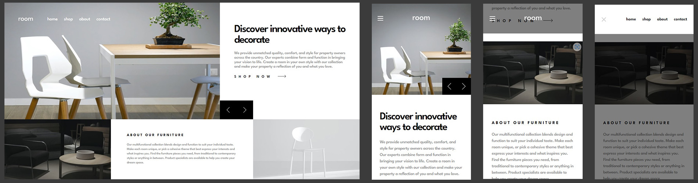

# Frontend Mentor - Room homepage solution

This is a solution to the [Room homepage challenge on Frontend Mentor](https://www.frontendmentor.io/challenges/room-homepage-BtdBY_ENq). Frontend Mentor challenges help you improve your coding skills by building realistic projects. 

## Table of contents

- [Overview](#overview)
  - [The challenge](#the-challenge)
  - [Screenshot](#screenshot)
  - [Links](#links)
- [My process](#my-process)
  - [Built with](#built-with)
  - [What I learned](#what-i-learned)
  - [Continued development](#continued-development)
- [Author](#author)

## Overview

### The challenge

Users should be able to:

- View the optimal layout for the site depending on their device's screen size
- See hover states for all interactive elements on the page
- Navigate the slider using either their mouse/trackpad or keyboard

### Screenshot

### Links

- Live Site URL: [Room Challenge Solution](https://room-challenge-ucz.netlify.app/)

## My process

### Built with

- CSS custom properties
- Flexbox
- CSS Grid
- Mobile-first workflow
- [React](https://reactjs.org/) - JS library
- [Next.js](https://nextjs.org/) - React framework
- [Tailwind CSS](https://tailwindcss.com/) - For styling

### What I learned

This was a lot of fun! One thing I was particularly worried about was making sure that the arrow buttons in desktop mode would align themselves with the bottom right image perfectly like they do in the design. This took some effort to make fully responsive, as Tailwind doesn't work with dynamic class names, but nothing a little elbow grease and some motivation didn't fix, the resulting code is pretty funny but you can't disagree with the results.

I'm very happy with the way this came out overall.

### Continued development

I want to learn more on flexbox and grid in general. It took me more time than it should have to finally nail down that part of the code.

## Author

- Frontend Mentor - [@uncoolzero](https://www.frontendmentor.io/profile/astroboard)
- Twitter - [@uncoolzero](https://www.twitter.com/uncoolzero)
